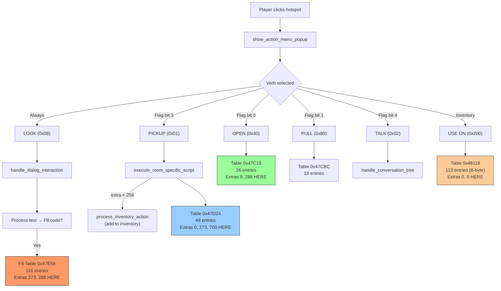

# Verb Dispatch Architecture — Complete System Documentation

## Overview

The game's verb action system is significantly more complex than initially documented. Instead of 4 dispatch tables, there are **8 distinct dispatch paths** with **7 dispatch tables** totaling over 320 handler entries.

## The "Unknown Room (-1)" Extras Mystery — SOLVED

Five extras (0, 9, 273, 288, 700) appeared in dispatch tables but NOT in any room's static hotspot data. Investigation revealed these are triggered through:
1. **Dialog text control codes** (F8 codes) — extras 273, 288
2. **Inventory item interactions** — extras 0, 9
3. **Dynamic hotspot modification** — extra 700
4. **Room 0 pickup sequence** — extra 0 (actually IS in Room 0)

---

## Verb Dispatch Flow



---

## Dispatch Tables Reference

| Verb Type | Function | Table Address | Entries | Entry Format | Trigger Condition |
|-----------|----------|---------------|---------|--------------|-------------------|
| **0x08** | `handle_dialog_interaction` | **0x47E58** | **116** | 6-byte | LOOK verb (always available) + F8 control code in text |
| **0x01** | `execute_room_specific_script` | 0x47D24 | 48 | 6-byte | PICKUP verb (hotspot flag bit 3) |
| **0x02** | `handle_conversation_tree` | *(none)* | N/A | N/A | TALK verb (hotspot flag bit 4) |
| **0x10** | `dispatch_hotspot_action_by_extra_id` | 0x47BF0 | 4 | 6-byte | *(verb type 0x10, not shown in icon table)* |
| **0x20** | `execute_script_table_0x47c10` | 0x47C10 | **0** | 6-byte | *(empty table, verb reserved but unused)* |
| **0x40** | `execute_script_table_0x47c18` | 0x47C18 | 26 | 6-byte | OPEN verb (hotspot flag bit 0) |
| **0x80** | `execute_script_table_0x47cbc` | 0x47CBC | 16 | 6-byte | PULL verb (hotspot flag bit 1) |
| **0x200** | `execute_complex_item_script_table` | 0x48118 | 113 | **8-byte** | USE inventory item on hotspot/item |

### Table Entry Formats

**6-byte entries** (most tables):
```
+0x00: short extra_id
+0x02: int  func_ptr (needs +0x10000 fixup)
```

**8-byte entries** (USE_ITEM table only):
```
+0x00: short item1_id (selected inventory item)
+0x02: short item2_id (target hotspot extra or item)
+0x04: int  func_ptr (needs +0x10000 fixup)
```

Sentinel value for all tables: `0xFFFF`

---

## The Verb Icon System

Function: `setup_action_menu_icons` at 0x14639

Dynamically populates `DAT_0004f7ac` (4-slot array) based on:
1. **Slot 0**: Always type 0x08 (LOOK/dialog) unless `mouse_hover_state == 3`
2. **Slots 1-3**: Conditional verbs from table at 0x47980, checked against `hotspot_action_flags` bits
3. **Slot 4**: Type 0x200 (USE item) if `selected_inventory_item != 0xFFFF`

### Verb Icon Table (0x47980, 7 entries × 5 bytes)

| Index | Verb Type | Icon Offset | Flag Mask | Description |
|-------|-----------|-------------|-----------|-------------|
| 0 | 0x0001 | 0x0000 | 0x08 (bit 3) | PICKUP |
| 1 | 0x0002 | 0x0E10 | 0x10 (bit 4) | TALK |
| 2 | 0x0010 | 0x3840 | 0x20 (bit 5) | *(unknown verb)* |
| 3 | 0x0020 | 0x4650 | 0x80 (bit 7) | *(empty table)* |
| 4 | 0x0040 | 0x5460 | 0x01 (bit 0) | OPEN |
| 5 | 0x0080 | 0x6270 | 0x02 (bit 1) | PULL |
| 6 | 0x0100 | 0x7080 | 0x40 (bit 6) | *(unknown verb)* |

Each hotspot's `action_flags` byte at offset +7 determines which verbs appear in the popup menu (bits correspond to flag masks above).

---

## Key Discovery: F8 Dialog Table

**Address:** 0x47E58 (data segment)  
**Entries:** 116 (extras 257-383, not all contiguous)  
**Trigger:** LOOK verb → `handle_dialog_interaction` → text contains F8 control code

This is the **largest dispatch table** and was completely missing from initial analysis. When dialog text contains the F8 control code (0xF8), the system reads the next 2 bytes as an extra ID and dispatches to this table.

### Process Flow

1. Player clicks hotspot with LOOK verb (always available)
2. `handle_dialog_interaction` called
3. System processes dialog text string from ALFRED.1 room text data
4. If F8 byte encountered: `extra_id = read_short(text_ptr); dispatch(F8_table, extra_id)`
5. Handler executes (can modify rooms, flags, animations, etc.)
6. Dialog continues or ends

### Notable F8 Handlers

- **Extra 273**: Overwrites walkbox data (changes walkable area mid-game)
- **Extra 288**: Counter mechanic (increments, triggers room change after 4 occurrences)
- **Extras 257-383**: Full range of game logic tied to examining objects

---

## The 5 "Phantom" Extras — Detailed Analysis

### Extra 0 — Room 0 Item Pickup (NOT phantom)

**Location:** Room 0 hotspot[4] at (174, 206), type 0x08, PICKUP enabled

**PICKUP Handler** (0x1E444, 787 bytes):
- Sets flag [0x49687] = 1
- Displays sticker from ALFRED.6 offset 0x60C87
- HIDES hotspots 4, 8, 9, 10 (moves to 640, 400)
- SHOWS hotspot 0 at (191, 243)
- Jumps to shared handler 0x1D2F5

**USE Handler** (item 0 on 0, 0x22F07, 6 instructions):
- Calls function 0x1BB21
- Loads text pointer [0xBA98]
- Jumps to `default_verb_response` (displays "can't do that" message)

**Trigger:** Navigate to Room 0, click hotspot[4], select PICKUP verb.

**Purpose:** Multi-step item pickup sequence. Part of a chain (extras 0-4) that progressively reveals/hides hotspots as the player interacts with objects in Room 0.

---

### Extra 9 — Inventory Item Stub

**Location:** NOT in any room data (inventory-only interaction)

**OPEN Handler** (0x1C9D5, 20 bytes, 4 instructions):
- Loads text pointer [0xB9C4]
- Jumps to `default_verb_response`

**USE Handler** (item 9 on 9, 0x22E3D, 4 instructions):
- Loads text pointer [0xBA50]
- Jumps to `default_verb_response`

**Trigger:** Select item 9 in inventory, USE on itself.

**Purpose:** Inventory item examination stub. Displays description text when player tries to examine or use item 9 on itself. This is a standard pattern for items with no special self-interaction.

---

### Extra 273 — Dialog-Triggered Walkbox Modifier

**Location:** NOT in any room data (dialog-triggered)

**PICKUP Handler** (0x1E81B, 20 bytes, 4 instructions):
- Stub → loads text [0xB9D0], jumps to `default_verb_response`

**F8 DIALOG Handler** (0x21254, 76 instructions):
- Reads 18 bytes from game state into buffer (walkbox data)
- Writes buffer to room_data offsets 0x221-0x232 (walkboxes 1-2)
- Sets room_data[0x213] = 3 (walkbox count)
- Clears room_data[0x84] flag
- Saves modified walkbox data to ALFRED.1 file
- Calls function 0x26FAB (likely recomputes walkability)

**Trigger:** Player LOOKs at a hotspot whose dialog text contains F8 control code with value 273 (encoded as `F8 11 01` in text stream).

**Purpose:** Dynamic walkbox modification. Changes the walkable area in the current room after certain story events. Example: A passage that was blocked becomes accessible, or a bridge that was up is now down.

**Story Context:** Triggered through dialog examining objects that change room geometry. The 18 bytes define new polygon walkbox coordinates.

---

### Extra 288 — Dialog Counter Mechanic

**Location:** NOT in any room data (dialog-triggered, but also has OPEN handler)

**OPEN Handler** (0x1C632, 214 bytes, 43 instructions):
- Checks if flag [0x49840] == 0 (first time only)
- Sets flag [0x49840] = 1
- Displays sticker from ALFRED.6 offset 0xB490 (size 0x216)
- SHOWS hotspot[18] at (519, 363)
- Writes hotspot data to ALFRED.1

**F8 DIALOG Handler** (0x217FA, 18 instructions):
- Calls function 0x24157 with param 0x4E (78)
- Increments counter at [0x95F4]
- Checks if counter == 4
- If true: calls function 0x1B666(room=27, ebx=2, edx=1) — **room/state transition**

**Trigger (OPEN):** Player uses OPEN verb on hotspot with extra 288 in Room 3.

**Trigger (F8):** Player LOOKs at 4 different hotspots across multiple rooms whose dialog text contains F8 code 288. Each examination increments the counter. On the 4th occurrence, triggers a state change.

**Purpose:** "Collect 4 clues" mechanic. Player must examine 4 specific objects (through LOOK verb → dialog → F8 code) to gather information. After all 4 are examined, the game advances to a new state (possibly unlocking room 27 or changing game state).

**Story Context:** Likely a puzzle where the player must investigate 4 related objects to progress. The OPEN handler separately reveals a hidden hotspot (possibly one of the 4 clues, or a reward after collecting all clues).

---

### Extra 700 — Major Cutscene Sequence

**Location:** NOT in any room data (dynamically assigned to a hotspot's extra field during gameplay)

**PICKUP Handler** (0x20781, 1174 bytes, 222 instructions):
1. **Palette Load:**
   - Loads 26330 bytes (0x66DA) from ALFRED.7 offset 0x1613CE
   - Processes palette data through color correction
   
2. **Sprite Animation Setup:** (4 animation structures)
   - **Animation 1:** Position (93, 88), data offset 8184, frames 1, direction 0, type 9
   - **Animation 2:** Position (767, ?), data offset determined at runtime
   - **Animation 3:** Position (68, 31), data offset 2108, frames 1, direction 0, type 7
   - **Animation 4:** Position (79, 95), data offset 7505, frames 1, direction 0, type 9
   - **Animation 5:** Position (54, 42), data offset 2268, frames 1, direction 0, type 8

3. **State Flags:**
   - Sets room_data[0x6C] = 1
   - Sets room_data[0x78] = 0
   - Sets [0x4FB9A] = 3 (game state flag)

4. **Tail Call:**
   - Jumps to 0x13A66 (likely cutscene engine)

**Trigger:** Player uses PICKUP verb on a hotspot whose extra field was **dynamically changed to 700** by an earlier handler. Some previous game event modifies a hotspot structure in memory to assign extra=700.

**Purpose:** Major story cutscene. The complex sprite animation setup + palette load + state changes suggest this is a significant story beat (possibly end-of-chapter, critical discovery, or transformation scene). The 5 simultaneous sprite animations indicate multiple objects/characters moving together.

**Story Context:** This is a "big moment" cutscene that plays when the player picks up a critical story object. The object doesn't start with extra 700 — it's assigned dynamically when certain conditions are met, ensuring the cutscene only plays at the right story moment.

---

## Implementation Notes for ScummVM

1. **F8 Dialog Table is Critical:** The LOOK verb's connection to the F8 table must be implemented. Without this, 116 handlers won't trigger.

2. **Verb Type Names in VERB_ACTIONS_COMPLETE.md are Misleading:**
   - Table "PICKUP" (0x47D24) is actually type 0x01 (room_specific_script)
   - Table "LOOK" (0x47BF0) is actually type 0x10 (only 4 entries, not the main LOOK verb)
   - The real LOOK verb (type 0x08) uses the F8 table at 0x47E58

3. **Dynamic Hotspot Extra Assignment:** Extra 700 requires implementing handlers that can modify hotspot structures at runtime. Scan all handlers for writes to `[current_room_data + hotspot_base + 7]` (position where extra field is stored).

4. **Counter/State Tracking:** Extra 288's counter at [0x95F4] must persist across save/load.

5. **Walkbox Runtime Modification:** Extra 273 demonstrates walkboxes are not static. Implement a walkbox refresh function that reloads from room_data after handlers execute.

6. **Verb Icon Grid Layout:** The 4-column popup grid is populated dynamically. Column positions map to verb types through the 0x47980 table, filtered by hotspot flags.

7. **process_inventory_action Function:** When PICKUP handler (type 0x01) is called with extra < 256, it first calls this function which adds the item to inventory. This is the actual "pickup" implementation.

---

## Technical Memory Addresses

### Global Variables
- **current_hotspot_extra_id:** 0x051760 (used by all dispatch tables)
- **selected_inventory_item:** 0x051774 (checked for USE verb)
- **hotspot_action_flags:** Current hotspot's flag byte (determines available verbs)
- **current_room_id:** 0x04FB94
- **mouse_hover_state:** Affects LOOK verb availability
- **action_pending_flag:** Set when verb selected, cleared after handler executes

### Dispatch Functions
- **room_specific_action_dispatcher:** 0x191CC (main dispatcher, type switch)
- **show_action_menu_popup:** 0x1280B (verb icon grid UI)
- **setup_action_menu_icons:** 0x14639 (populates DAT_0004f7ac)
- **handle_dialog_interaction:** 0x18720 (F8 code processor)
- **execute_room_specific_script:** 0x18618 (type 0x01 handler)
- **process_inventory_action:** Called for extras < 256 in type 0x01
- **execute_script_table_0x47c18:** 0x19115 (type 0x40 OPEN)
- **execute_script_table_0x47cbc:** Type 0x80 PULL
- **execute_complex_item_script_table:** Type 0x200 USE ITEM
- **default_verb_response:** 0x25487 (displays "can't do that" text)

### Data Structures
- **Verb icon table:** 0x47980 (7 entries × 5 bytes)
- **Verb type slots:** DAT_0004f7ac (4 shorts, dynamically populated)
- **Room data base:** [0xFAC8] (pointer to current room's data structure)
- **Inventory array:** `inventory_item_ids` at unknown address

---

## Research Credits

**Investigation Date:** February 2026  
**Tools Used:** Ghidra 10.x, Capstone 5.x, custom Python analysis scripts  
**Key Findings:**
- F8 dialog table at 0x47E58 (116 entries) — largest dispatch table
- Dynamic hotspot modification system (extra 700)
- Dialog-driven game logic (extras 273, 288)
- Verb icon system with 8 dispatch paths
- Counter/state-based progression mechanics

**Files Generated:**
- `dump_dispatch_tables.py` — Full table dumps
- `dump_verb_system.py` — Verb architecture cross-reference
- `disasm_f8_handlers.py` — F8 handler disassembly
- `/tmp/verb_system.txt` — Complete verb mapping output
- `/tmp/f8_handlers.txt` — Phantom extra handler analysis

---

## Next Steps

1. **Update VERB_ACTIONS_COMPLETE.md:** Add 116 F8 handlers with correct table attribution
2. **Document ALL 320+ handlers:** Current doc only covers 94 handlers from 4 tables
3. **Map F8 codes in ALFRED.1:** Scan all room text data for F8 bytes, build trigger map
4. **Find extra 700 assignment code:** Search for handlers that write 700 (0x02BC) to hotspot structures
5. **Implement verb system in ScummVM:** Use this architecture as design reference
6. **Test walkbox modification:** Extra 273 requires runtime walkbox updates
7. **Profile counter at 0x95F4:** Track all reads/writes to understand full extra 288 logic
